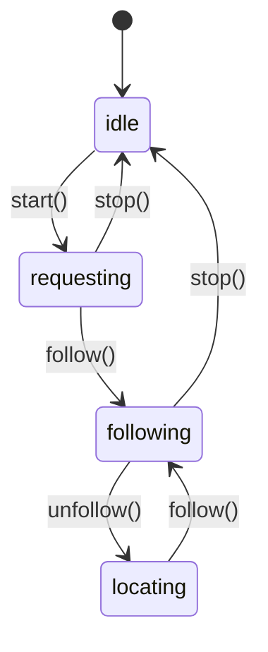

#  Leaflet.Boating

Boating plugin for [Leaflet](http://leafletjs.com/), showing heading, speed and location.  
Built and tested for Leaflet 1.9.x and 2.0.x

## Usage

### Set up

#### With `<script>` tag
Add the following in html headers
```html
<link rel="stylesheet" href="https://unpkg.com/leaflet.boating@latest/dist/L.Control.Boating.css" />
<script src="https://unpkg.com/leaflet.boating@latest/dist/L.Control.Boating.js"></script>
```
Add the following snippet to your map initialization
```js
// leaflet 1.9.x
L.control.boating(OPTIONS).addTo(map)

// leaflet 2.0.x
new L.Control.Boating(OPTIONS).addTo(map)
```

#### With npm

Add package to your project
```
npm install leaflet.boating
```
Add the following snippet to your map initialization
```js
import { ControlBoating } from 'leaflet.boating'
import "leaflet.boating/dist/L.Control.Boating.css"

...

new ControlBoating().addTo(map)
```

### Options

The boating control inherits options from [Leaflet Control](https://leafletjs.com/reference.html#control).  
To customize the control, pass an object with your custom options to the boating control.

```js
new ControlBoating(OPTIONS).addTo(map)
```
Possible options are listed in the following table

| Option | Type | Description | Default |
| --- | --- | --- | --- |
| `position` | `string`  | position of the control | `topleft` |
| `motionCacheLength` | `number`  | maximum number of averaged GPS points for smoothest movements | `4` |
| `motionCacheMaxAge` | `number`  | max age in milliseconds for the averaged GPS points for smoothest movements, applied at the time of calculation, not afterwards. | `10000` |
| `onLocationError` | `function`  | called on location errors, receives the [`ErrorEvent`](https://leafletjs.com/reference.html#errorevent) | *(see source in [Boating.js](src/Boating.js))* |
| `boat.color` | `string`  | boat color | `#3388ff` |
| `boat.circleColor` | `string`  | circle color | `#3388ff` |
| `boat.lineColor1` | `string`  | first color for the line | `#ffcc00` |
| `boat.lineColor2` | `string`  | second color for the line | `#3388ff` |
| `legend.position` | `string`  | position of the legend | `bottomright` |
| `legend.html` | `string`  | legend HTML rendered with [`L.Util.template`](https://leafletjs.com/reference.html#util-template). Available placeholders: `{heading}`, `{speed}`, `{lat}`, `{lng}` | *(see source in [Legend.js](src/Legend.js))* |
| `legend.css` | `string`  | legend styles, injected once and scoped to the legend. Use `:scope` to target the legend container itself | *(see source in [Legend.js](src/Legend.js))* |

**Note:** if multiple `ControlBoating` (or `Boating(map, ...)`) are added to the same map, they share a single underlying tracking state — only the options passed to the *first* one are applied; options passed to later instances on the same map are silently ignored.

## Development

Feel free to suggest or develop new features or modifications :)

### Files

`src` contains the different Classes

`src/iife.js` wrapper to build `dist/L.Control.Boating.js`, for the classic `<script>` tag

`src/esm.js` wrapper to build `dist/L.Control.Boating.esm.js`, for `import`

### States

The control is a small state machine (`idle`, `requesting`, `following`, `locating`), driven by `start()`, `stop()`, `follow()` and `unfollow()` functions:


```mermaid
stateDiagram-v2
    [*] --> idle
    idle --> requesting: start()
    requesting --> idle: stop()
    requesting --> following: follow()
    following --> idle: stop()
    following --> locating: unfollow()
    locating --> following: follow()
```

### Dev and build

`dist` files are bundled with [Rollup](https://rollupjs.org) (see `rollup.config.js`)

```
npm install
npm run dev     # builds dist files on every change, and serve on port 8080
npm run build   # builds dist files once
```
During dev, index files are served on [http://localhost:8080/test/](http://localhost:8080/test/). Remember to reload pages manually, no hot reload configured !

### Unit tests

`npm run test` runs `test/utils.test.js`, testing the pure helpers exported from `src/utils.js` (angle math, coordinate formatting, motion smoothing)

## Demo

For an example case, see the file `index.html`  
For more, see the [online demo](https://cdupre.github.io/leaflet.boating)

## Screenshot

<div align="center">
  
</div>

## License

[MIT](./LICENSE)
