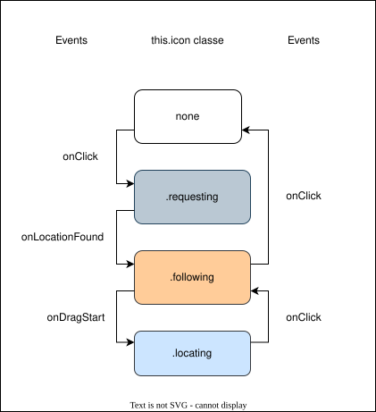

# Leaflet.Boating

## Usage
Include the CSS and JavaScript files
```
<link rel="stylesheet" href="//PATH/TO/L.Control.Boating.css" />
<script src="//PATH/TO/L.Control.Boating.js"></script>
```
Add the following snippet to your map initialization
```
L.control.boating().addTo(map)
```
Leaflet.Boating is extended from leaflet Control. See [documentation](https://leafletjs.com/reference.html#control) for options and methods

## Developers
#### App workflow
<div align="center">
  
</div>