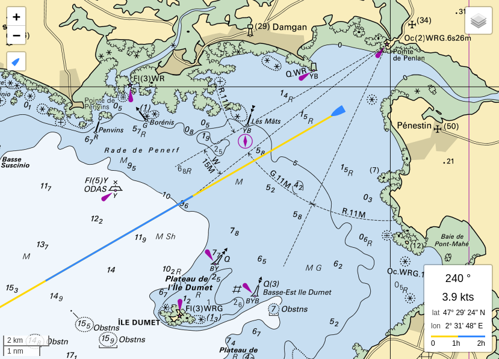

# Leaflet.Boating

Boating plugin for [Leaflet](http://leafletjs.com/), showing heading, speed and location.  
Built and tested for Leaflet 1.9.x and 2.0.0-alpha.1

## Usage

### Set up

#### With `<script>` tag
Add the following in html headers
```html
<link rel="stylesheet" href="https://unpkg.com/leaflet.boating@latest/dist/L.Control.Boating.css" />
<script src="https://unpkg.com/leaflet.boating@latest/dist/L.Control.Boating.js"></script>
```
Add the following snippet to your map initialization
```js
L.control.boating().addTo(map)
```

#### With npm

Add package to your project
```
npm install leaflet.boating
```
Add the following snippet to your map initialization
```js
import Boating from 'leaflet.boating'
import "leaflet.boating/dist/L.Control.Boating.css"

...

new Boating().addTo(map)
```

### Options

The boating control inherits options from [Leaflet Controls](https://leafletjs.com/reference.html#control).  
To customize the control, pass an object with your custom options to the boating control.

```js
L.control.boating(OPTIONS).addTo(map)

or

new Boating(OPTIONS).addTo(map)
```
Possible options are listed in the following table

| Option | Type | Description | Default |
| --- | --- | --- | --- |
| `position` | `String`  | Position of the control | `topleft` |
| `circleColor` | `String`  | Circle color | `#3388ff` |
| `boatColor` | `String`  | Boat color | `#3388ff` |
| `lineColor1` | `String`  | First color for the line | `#ffcc00` |
| `lineColor2` | `String`  | Second color for the line | `#3388ff` |
| `motionCacheLength` | `Number`  | number of averaged GPS samples for smoothest movements | `4` |
| `legendPosition` | `String`  | Position of the legend | `bottomright` |
| `legendHTML` | `String`  | Legend HTML rendered with [`L.Util.template`](https://leafletjs.com/reference.html#util-template). Available placeholders: `{heading}`, `{speed}`, `{lat}`, `{lng}` | *(see source in [core.js](src/core.js))* |
| `legendCSS` | `String`  | Legend styles, injected once and scoped to the legend. Use `:scope` to target the legend container itself | *(see source in [core.js](src/core.js))* |

### Events

You can personnalize location errors:

```js
const boating = L.control.boating().addTo(map)
boating.onLocationError = function (e) {
  console.error(e)
  boating.stop()
  ...
}

or

const boating = new Boating().addTo(map)
boating.onLocationError = function (e) {
  console.error(e)
  boating.stop()
  ...
}
```

### Methods

| Method | Description |
| --- | --- |
| `start()` | Begin watching the location (same as clicking the control) |
| `stop()` | Stop watching and remove the boat, circle, heading line and legend |

## Development

Feel free to suggest or develop new features or modifications :)

`src/core.js` got the plugin's logic. The single factory function, `createPlugin()`
returns the `Boating` control

`src/iife.js` wrapper to build `dist/L.Control.Boating.js`, for the classic `<script>` tag

`src/esm.js` wrapper to build `dist/L.Control.Boating.esm.js`, for `import`

`dist` files are bundled with [Rollup](https://rollupjs.org) (see `rollup.config.js`)

```
npm install
npm run dev     # builds dist/ on every change
```
During dev, index files are served on [http://localhost:8080/test/](http://localhost:8080/test/). Remember to reload pages manually, no hot reload configured !

## Demo

For an example case, see the file `index.html`  
For more, see the [online demo](https://cdupre.github.io/leaflet.boating)

## Screenshot

<div align="center">
  
</div>

## License

[MIT](./LICENSE)
