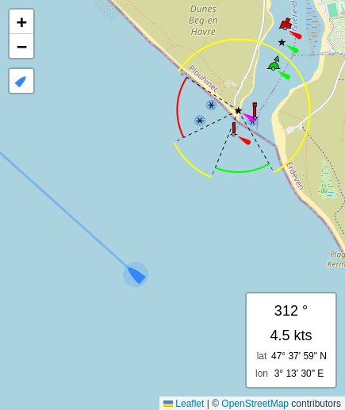

# Leaflet.Boating

A simple [Leaflet](http://leafletjs.com/) plugin to geolocate the user and display heading, speed and location like a simple navigation app

Tested with Leaflet 1.9.2 in Firefox and Chrome

## Demo

[online demo](https://cdupre.github.io/leaflet.boating/demo/)

## Usage

Include the CSS and JavaScript files
```html
<link rel="stylesheet" href="path/to/L.Control.Boating.css" />
<script src="path/to/L.Control.Boating.js"></script>
```
Add the following snippet to your map initialization
```js
L.control.boating().addTo(map)
```
Leaflet.Boating is extended from Leaflet Control. See [documentation](https://leafletjs.com/reference.html#control) for options and methods

## Screenshot

<div align="center">
  
</div>

## License

[MIT](./LICENSE.md)